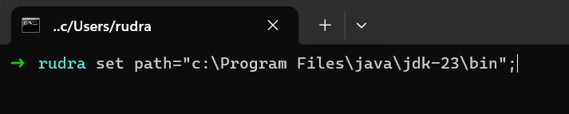

# Study of class path and java runtime environment

There are two ways of set a path variable

1. By ordinary method
2. By command prompt

## 1. By ordinary method:

***Step 1***: Open a Environment Variables Dialog box by search box

***Step 2***: Click on New Button -> Enter PATH as a variable name and copy the path of bin file of JDK andpaste to the variable value -> click on

## 2. By command prompt:

***Syntax***: `set path=”<drive>:[%PATH%]”;`

